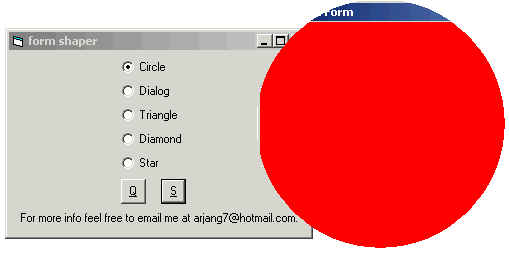



## Absolute Form Shape \(s\) program

### Description

if you like to change the shape of your form (s) in a VB application this is the program to teach you how to do it. it will allow you to change the shape of the form to a Circle , Dialog , Triangle , Diamond or even a really cute STAR.

I used the functions of this code a lot in diffrent programms.
 
### More Info
 

             |
---                |---
**Submitted On**   |1998-09-03 19:59:00
**By**             |[Arjang](https://github.com/Planet-Source-Code/PSCIndex/blob/master/ByAuthor/arjang.md)
**Level**          |Advanced
**User Rating**    |4.8 (24 globes from 5 users)
**Compatibility**  |VB 6\.0
**Category**       |[Graphics](https://github.com/Planet-Source-Code/PSCIndex/blob/master/ByCategory/graphics__1-46.md)
**World**          |[Visual Basic](https://github.com/Planet-Source-Code/PSCIndex/blob/master/ByWorld/visual-basic.md)
**Archive File**   |[CODE\_UPLOAD9595932000\.zip](https://github.com/Planet-Source-Code/arjang-absolute-form-shape-s-program__1-11217/archive/master.zip)

### API Declarations

a lot

